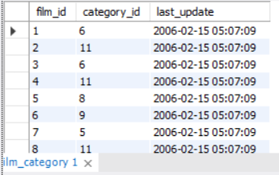

# Resolução perguntas

## Tabela 1

> 1 -Quais constraints a coluna address_id poderia ter? Por quê?

### Resposta 1

A coluna address_id possui a constraint Primary Key para que exista um número identificador único. Além disso, a Primary Key não permite que ela seja nula.

> 2- A coluna city_id é um número. Você consegue identificar que tipo de constraint foi aplicado nela?

### Resposta 2

A coluna city_id é do tipo Foreign Key , e nela foi aplicada a constraint Foreign Key.

> 3- A coluna address (endereço) possui uma constraint . Qual tipo de constraint seria interessante ser aplicado a ela para que sempre exista um valor na coluna quando uma nova linha for criada?

### Resposta 3

A restrição aplicada na coluna address é a restrição NOT NULL . Dessa maneira, é interessante que a coluna address sempre esteja preenchida em função de ser uma informação crucial para essa tabela, além de a tabela não fazer sentido sem essa informação preenchida.

## Tabela 2

> 1 - Que tipo de constraint a coluna city_id possui?

### Resposta 1

 A coluna city id possui o tipo _Primary Key .

> 2- Qual é o motivo da coluna country_id não possuir nomes de country (país)? Ela é algum tipo de chave primária ou estrangeira?

### Resposta 2

Isso acontece porque a coluna country_id é apenas uma referência para a sua tabela original, e o número que é exibido nessa tabela representa uma Foreign Key . Caso você queira ver o nome do país, você deve ir até a tabela na qual o country_id é uma Primary Key .

## Tabela 3

> 1 - Qual coluna possui uma Primary Key ?

### Resposta 1

A coluna film_id possui uma Primary Key .

> 2- Qual coluna possui uma Foreign Key ?

### Resposta 2

A coluna category_id possui uma Foreign Key .